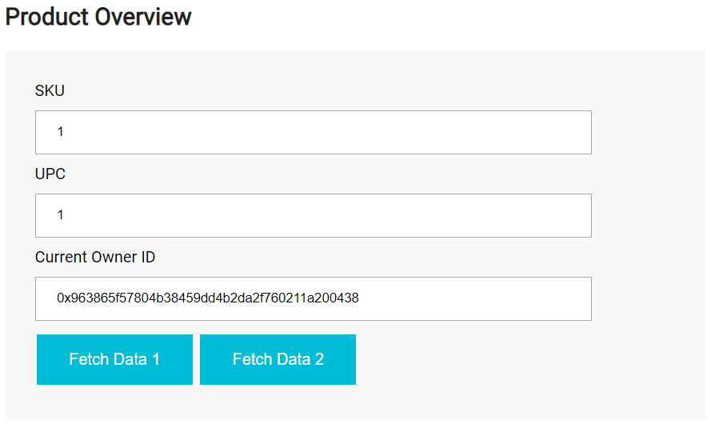
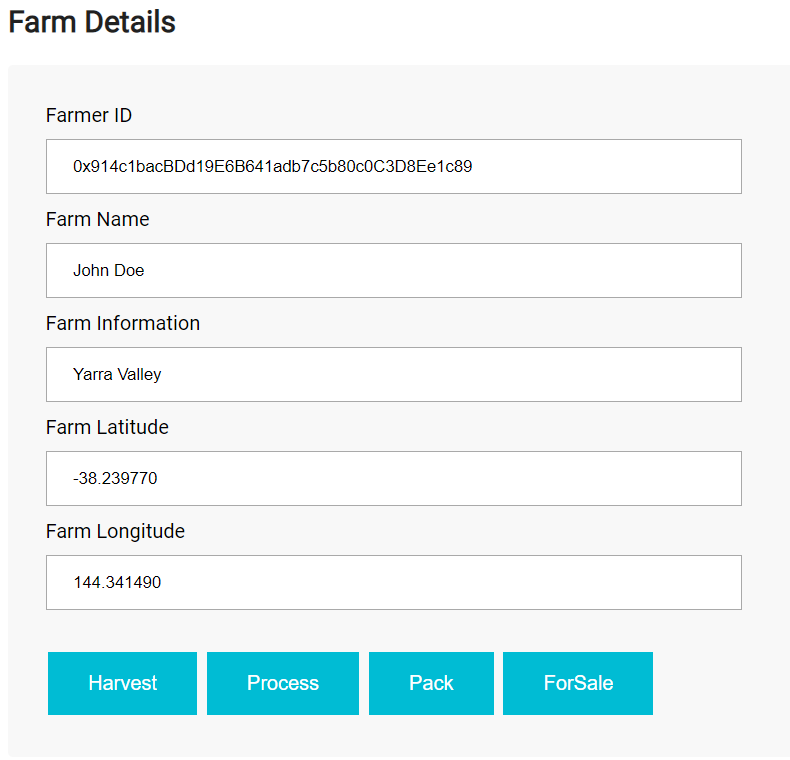
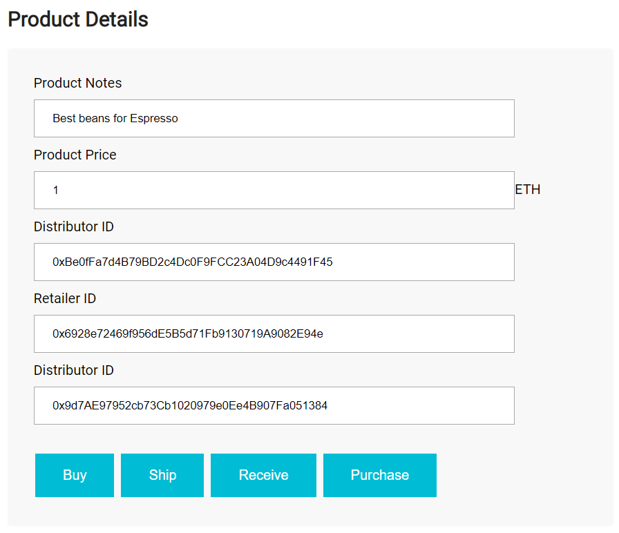
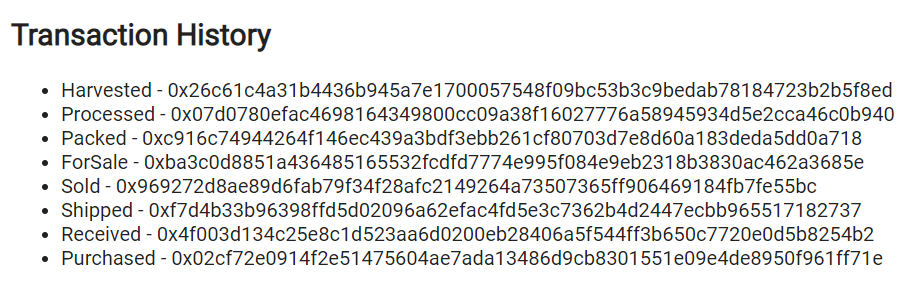

# Architect a Blockchain Supply Chain Solution - Part B

In this project, I'll provide an Ethereum DApp that demonstrates a Supply Chain flow between a Seller and Buyer. The user story is similar to any commonly used supply chain process. A Seller can add items to the inventory system stored in the blockchain. A Buyer can purchase such items from the inventory system. Additionally a Seller can mark an item as Shipped, and similarly a Buyer can mark an item as Received.

The DApp User Interface when running should look like...






## Rubric Points
### Here I will consider the [rubric points](https://review.udacity.com/#!/rubrics/1710/view) individually.

[//]: # (Image References)
[image1]: ./images/Activity.PNG "Activity Diagram"
[image2]: ./images/Sequence.PNG "Sequence Diagram"
[image3]: ./images/State.PNG "State Diagram"
[image4]: ./images/Class.PNG "Classes (Data Model) Diagram"

[image5]: ./images/Tests.PNG "Smart Contract Tests"
[image6]: ./images/Contract.PNG "Contract"
[image7]: ./images/Tx.PNG "Transaction"

## UML Diagrams 
### Criteria 1
Student provides full Activity diagram for their supply chain DApp.
### Meet Specifications
Student provides Activity diagram complete with swim lanes, actors and behaviors.
![alt text][image1]

### Criteria 2
Student provides full Sequence diagram for their supply chain DApp.
### Meet Specifications
Student provides Sequence diagram complete with objects and interactions.
![alt text][image2]

### Criteria 3
Student provides full State diagram for their supply chain DApp.
### Meet Specifications
Student provides full State diagram complete with states, including creation and final state.
![alt text][image3]

### Criteria 4
Student provides full Classes (Data Model) diagram for their supply chain DApp.
### Meet Specifications
Student provides Classes diagram modeling their data solution.
![alt text][image4]

## Getting Started

These instructions will get you a copy of the project up and running on your local machine for development and testing purposes.

### Prerequisites
Please make sure you've already installed ganache-cli, Truffle and enabled MetaMask extension in your browser. Ganache is a personal Ethereum blockchain which you can use to run tests, execute commands, and inspect state while controlling how the chain operates. Truffle is a development environment, testing framework for blockchains using the Ethereum Virtual Machine (EVM). Metamask allows you to run Ethereum dApps right in your browser without running a full Ethereum node.

```
npm install -g ganache-cli
```
```
npm install -g truffle@4.1.14
```
This will use Solidity v0.4.24 by default.

### Installing

Clone this repository
Change the directory to ```project-6``` folder and install all requisite npm packages (as listed in ```package.json```):

```
cd project-6
npm install
```

Launch Ganache:

```
ganache-cli -m "arctic grape bag visit behave hurt impose silent shy essay quiz tragic"
```

In a separate terminal window, Compile smart contracts:

```
truffle compile
```

This will create the smart contract artifacts in folder ```build\contracts```.

Migrate smart contracts to the locally running blockchain, ganache-cli:

```
truffle migrate
```

Test smart contracts:

```
truffle test
```

All 10 tests should pass.

In a separate terminal window, launch the DApp:

```
npm run dev
```

## Built With

* [Ethereum](https://www.ethereum.org/) - Ethereum is a decentralized platform that runs smart contracts
* [Truffle Framework](http://truffleframework.com/) - Truffle is the most popular development framework for Ethereum with a mission to make your life a whole lot easier.

## Write smart contracts with functions.
I wrote all the required functions for SupplyChain.sol, Ownable.sol, ConsumerRole.sol, RetailerRole.sol and DistributorRole.sol.

## Test smart contract code coverage
All tests are approved without error.
![alt text][image5]

## Deploy smart contract on a public test network (Rinkeby)
Smart contract is deployed on the Ethereum RINKEBY test network.

![alt text][image6]

## Modify client code to interact with a smart contract
Client code interacts with smart contract.

![alt text][image7]